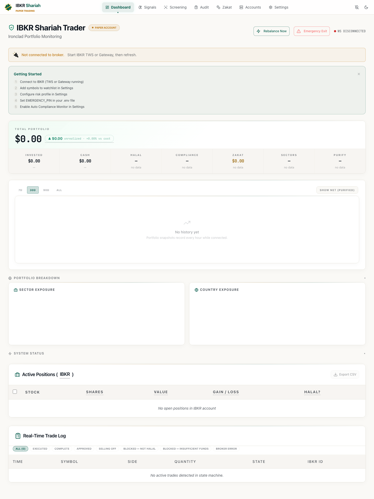
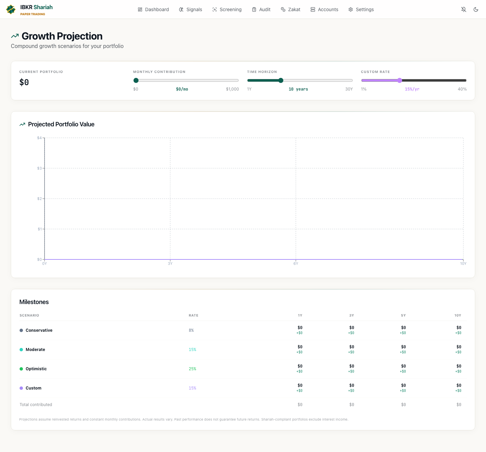

# ibkr-trader-core

[](https://github.com/dozken/ibkr-trader-core/actions/workflows/ci.yml)
[](LICENSE)
[](https://www.python.org/downloads/)
[](https://fastapi.tiangolo.com/)
[](https://react.dev/)

Shariah-compliant trading bot framework for Interactive Brokers, with a pluggable strategy interface.

> Open-core of [ibkr-trader](https://github.com/dozken/ibkr-trader) — the framework is MIT, run it with the bundled SMA reference strategy or plug in your own.



<p align="center"><em>Portfolio dashboard — compliance health, zakat, sector exposure, real-time positions &amp; trade log.</em></p>



<p align="center"><em>Compound-growth projections — model contributions &amp; horizons across return scenarios.</em></p>

## What you get

- **FastAPI backend + React frontend** — full webapp with portfolio, settings, alerts, compliance, zakat pages.
- **IBKR integration** — order routing, reconciliation, account manager.
- **AAOIFI Shariah screening** — debt/cash/revenue ratio checks, sector blocklist, dynamic VIX-aware buffer.
- **Zakat calculator** — hawl tracking, purification of haram income.
- **Multi-channel alerts** — Telegram, email, Slack.
- **Observability** — Prometheus metrics + provisioned Grafana dashboard.
- **Pluggable `Strategy` interface** — ship with SMA crossover and buy-and-hold reference impls, swap with your own via env var.

## What you don't get (by design)

This is the framework. The author's private alpha strategies (ML/RL signal models, tuned halal universe filters, trained weights) live in a separate proprietary repo. You can run this with the included reference strategies, or write your own.

## Quick start

```bash
git clone https://github.com/dozken/ibkr-trader-core.git
cd ibkr-trader-core
cp ibkr_core/.env.example ibkr_core/.env  # then fill in your IBKR creds
docker compose up --build
```

Open <http://localhost:8000/docs> for API, <http://localhost:3000> for UI.

By default uses `SMACrossover` strategy. To swap:
```bash
STRATEGY_CLASS=ibkr_core.strategies.buy_and_hold:BuyAndHold docker compose up
```

## Plug in your own strategy

```python
# my_alpha/strategy.py
from ibkr_core.core.strategy import Strategy, MarketContext
from ibkr_core.features.trading.schemas import TradeSignal

class MyAlpha(Strategy):
    name = "MyAlpha"

    async def generate_signals(self, ctx: MarketContext) -> list[TradeSignal]:
        # your logic
        return [...]
```

Then run:
```bash
STRATEGY_CLASS=my_alpha.strategy:MyAlpha docker compose up
```

See [`ibkr_core/core/strategy/base.py`](ibkr_core/core/strategy/base.py) for the full interface, or the [example momentum strategy](examples/momentum_strategy/) for a complete external plugin.

## Compliance

Screening follows AAOIFI Shariah standards (33% debt-to-asset, 33% cash-to-asset, 5% non-compliant revenue caps by default). Buffers tighten under VIX stress. See [`docs/COMPLIANCE.md`](docs/COMPLIANCE.md).

**Riba (interest), short selling, margin, and gharar-heavy instruments are blocked at the framework level — not just the strategy.**

## Project layout

```
ibkr_core/
  core/                  framework primitives (db, auth, audit, websocket)
  core/strategy/         Strategy ABC + plugin loader
  strategies/            SMA + buy-and-hold reference impls
  features/
    compliance/          AAOIFI screening
    zakat/               hawl + purification calc
    trading/             IBKR integration, order routing
    portfolio/           positions + P&L
    alerts/              telegram / email / slack
    settings/
  migrations/            alembic
frontend/                React + Vite + Tailwind
infra/                   prometheus + grafana provisioning
docs/                    architecture + ops guides
```

## Status

Early beta (v0.3.x). Strategy interface is stable; other APIs may change before 1.0.

## Contributing

See [CONTRIBUTING.md](CONTRIBUTING.md). Bug fixes, new reference strategies, and compliance improvements welcome.

## License

MIT — see [LICENSE](LICENSE).
